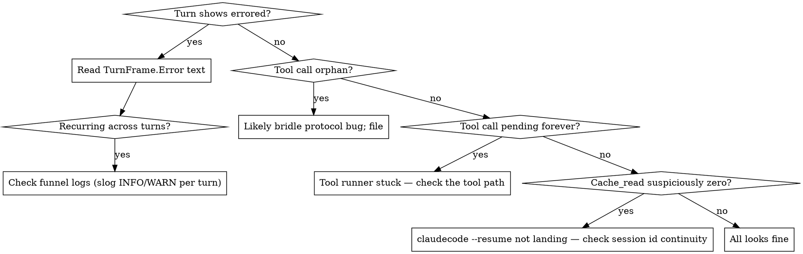

# Observability Operator Runbook

**Status:** Phase A–G complete; runbook covers v0.2 (rich rendering)
**Date:** 2026-05-12
**Author:** Plumb
**Parents:**
- `docs/2026-05-12-nexus-watch-and-observability-core.md` (design)
- `docs/2026-05-12-funnel-observability-audit.md` (Phase E audit)

## What this is

The observability stack gives operators a per-aspect view of what each
aspect is doing inside its deliberation turns — the model's reasoning,
every tool call with its inputs and results, file diffs, step
boundaries, presence transitions, and chat traffic — surfaced through
two interchangeable renderers:

- **Dashboard** (browser): `ObserveView` panel under the dashboard SPA
- **Terminal** (`nexus-watch`): ANSI-rendered stream, same data

Both consume the same `observe.frame` push from the broker. Pick
whichever fits the moment; switching back and forth is supported and
expected.

## Quick start

### Dashboard

1. Log into the dashboard (passkey or token, as configured).
2. Click an aspect in the sidebar — the ObserveView loads.
3. Frames stream live; the broker replays the per-aspect tail
   (default 500 frames) on subscribe.

### Terminal

```sh
nexus-watch --addr wss://nexus.local:8443 --operator-token-file ~/op.token
```

Once connected:
- Aspects come online via presence frames.
- `/switch <name>` flips to another aspect's stream.
- `/history <n>` replays the last `n` frames for the current aspect.
- `/say <text>` posts an operator message into chat.
- `/new <name> <prompt>` starts a fresh chat thread.
- `/help` lists the slash commands.
- `/quit` exits cleanly.

`--no-color` (or `NO_COLOR=1`) disables ANSI for piping into less or a
log file.

## Reading a turn

Each turn surfaces as a single `TurnBlock` (dashboard) or `─── turn ───`
header (terminal). The components:

### Header
- **Turn id** (short hash; full id available in the wire frame).
- **Label**: `main`, `compact`, or `filter-judge`. `main` is the
  operator-addressed deliberation; `compact` runs when the funnel hits
  its summarization threshold mid-deliberation; `filter-judge` is the
  cheap-model judge deciding whether to post the natural reply.
- **Status**: `in_flight` while the turn is running, `complete` on
  success, `errored` on provider/harness failure (final error appears
  in the body).
- **Model / provider / trigger**: which model+provider ran the turn,
  and the chat message id that triggered it (if any).

### Body — events in order
- **Text** (`💭`): the model's reasoning prose between tool calls.
- **Tool call** (`🔧`): one model-issued tool invocation. Shows name,
  key arg (file path for Edit/Write/MultiEdit; truncated input JSON
  otherwise), and a state pill:
  - `ok`: result returned cleanly
  - `error`: tool runner reported an error
  - `pending`: still running (in-flight turn)
  - `orphan`: result without a paired call — protocol oddity, treat as
    a bug signal
- **Tool result**: the broker truncates to ≤200 chars in `.preview`;
  expand via the dashboard chevron for full input + preview.
- **Artifact**: when a tool is one of `Edit` / `Write` / `MultiEdit` /
  `NotebookEdit`, the broker pre-parses a structured diff. Renderers
  show it as a red/green old↔new pair (file_edit, notebook_edit,
  multi_edit) or a single new-content block (file_write). Long
  content truncates with a "show more" toggle on the dashboard; the
  terminal caps to 200 runes per side and renders an ellipsis.
- **Step** (`╶─ step N ─╴`): bridle's round boundary between
  tool-call cycles. Useful for following multi-step reasoning.

### Footer
- **Tokens**: input / output.
- **Cache**: read-from-cache and create-to-cache when non-zero
  (claudecode and claude-api report these; ollama doesn't).
- **Cost**: `$0.NNNN` when the provider returns it.
- **Duration**: wall-clock from `Started` to `Ended`.

## Reading other frames

### Presence
Marker line on aspect register / graceful deregister / ungraceful WS
close. The dashboard's pill shows online state; the terminal
renders `[+plumb registered]` / `[-plumb ws_closed]` etc.

### Chat
Inbound (`◀`) and outbound (`▶`) chat messages attributed to this
aspect. ChatFrames appear independent of turn state — chats can land
between turns or during one.

## Triage flow: "is something wrong?"



## Wire shape (for tool-builders)

A subscribed operator receives one `observe.frame` envelope per Grouper
emission. The envelope's payload is `ObserveFramePayload`:

```json
{
  "aspect": "plumb",
  "frame": {
    "kind": "turn",                          // or "chat" / "presence"
    "aspect": "plumb",
    "seq": 42,
    "ts": "2026-05-12T05:30:00Z",
    "payload": { ... }                        // TurnFrame / ChatFrame / PresenceFrame
  }
}
```

Frame ordering: `seq` is monotonic per aspect — sub-second reconnects
should pass `since_seq` on `subscribe.observe` to fetch only the
new tail.

For complete type shapes see `nexus/observability/types.go`.

## Topology — where the data comes from

**Embedded Frame (in-process):** `nexus/cmd/nexus/main.go` constructs
the funnel with `funnel.Config.ObservabilityHook =
obsHub.GrouperFor(aspectName)` so bridle events flow directly into
the Hub's per-aspect Grouper. Same process; no wire crossing.

**Remote aspects (agentfunnel):** <operator-host>, dMon, etc run their
funnel in a different process. `runtime/obsforward.WSForwarder`
marshals each `BeginTurn` / `OnBridleEvent` / `EndTurn` into
`observe.begin` / `observe.event` / `observe.end` frames and sends
them via the existing aspect WS connection. The broker's
`observe_inbound.go` handlers decode, look up
`Hub.GrouperFor(c.registeredAs)` — authenticated identity from the WS
connection, never from the payload — and feed the Grouper.

**Filter judge:** when an aspect is configured with `filter: cheap`,
the post-hoc judge turn is forwarded under the `filter-judge` label so
operators can see what the judge looked at.

## Common subscribe / unsubscribe lifecycle

```
operator → broker:    subscribe.observe { aspect: "plumb" }
broker  → operator:   [observe.frame × N]      (tail replay)
broker  → operator:   subscribe.ack
broker  → operator:   observe.frame {...}      (live frames as they arrive)
operator → broker:    unsubscribe.observe { aspect: "plumb" }
broker  → operator:   subscribe.ack
```

Subscription is per WS connection and per aspect. Multiple aspects can
be subscribed simultaneously; switching aspects in the dashboard
unsubscribes the previous and subscribes the new.

## What this view does NOT show

- **Frame-internal logs** (slog INFO/WARN) — those go to the nexus
  process stdout/stderr, not the operator surface.
- **Mid-turn chat messages received but not yet triaged** — those land
  on the chat surface, not the observability stream.
- **bridle's internal retries / fallbacks** — the bridle harness
  collapses these into a single `TurnDone` or `TurnError`.

## Known limitations (v0.2)

- Terminal artifact diffs cap to 200 runes per side; the dashboard's
  "show more" toggle isn't mirrored. If you need the full diff,
  switch to the dashboard.
- `--operator-token-file` is recommended over `--operator-token`
  for shell-history hygiene.
- The dashboard ObserveView buffers HISTORY_CAP=200 frames client-
  side. Refreshing the panel re-fetches from the broker's tail.

## Filing issues

Observability stack issues — wire decode failure, missing event kind,
renderer crash — are best reported with:
1. The `aspect` name.
2. A turn id or sequence number (visible in both renderers).
3. Whether you're on the dashboard, terminal, or both.

Bridle-side bugs (an event type that didn't carry the right payload)
need a bridle issue; broker-side decoding issues need a nexus issue.
The `event_kind` field in `observe.event` is your fastest path to
which side owns it.
